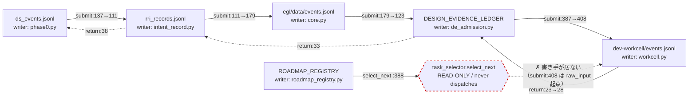

# 2DER 台帳フロー図（本線を台帳語で / 実測 2026-07-22）

- **これは何か:** canonical 運用台帳 12 本を「1 本の機能としての 2DER」の設計図として描く。
  1,313 のコード辺は人間が捌けないが、台帳 12 ノードなら本線が読める。
- **正直な設計:** データは台帳ファイル間を直接流れない。orchestrator（`submit.py` 前向き /
  `return_loop.py` 戻り）が各台帳の **sole writer** を順に呼ぶ。図の辺 = 1 往復の write シーケンス。
- **生成:** `egl/structure/s11_ledger_flow.py`（`--check` で各行番号の裏づけを検証＝腐敗検知）
- **典拠:** s10 登記簿（writer 解析）+ submit.py/return_loop.py の実行番号 + DE-0490（台帳保全済み）

## §1. 本線（canonical 12 本、すべて sole writer）



## §2. 前向き 1 往復（`submit.py`）

| # | 系 | 台帳 | 呼出 | シンボル | 何を書くか |
|---|---|---|---|---|---|
| 1 | DS | `ds_events.jsonl` | `twoder/submit.py:137` | `record_dialogue_event` | 入力を対話イベントとして記録 |
| 2 | RRI | `rri_records.jsonl` | `twoder/submit.py:111` | `detect` | admission/intent を解決・記録 |
| 3 | EGL | `DESIGN_EVIDENCE_LEDGER.jsonl` | `twoder/submit.py:123` | `admit_design_evidence` | DE admission（admission request 時） |
| 4 | EGL | `events.jsonl` | `twoder/submit.py:179` | `answer_question` | self-grounding 照会 → EGL SoR event |
| 5 | DW | `events.jsonl` | `twoder/submit.py:408` | `create_task` | タスク生成（CREATE）※raw_input 起点 |

## §3. 戻り（`return_loop.py`）— ループは閉じている

| # | 系 | 台帳 | 呼出 | シンボル | 何を書くか |
|---|---|---|---|---|---|
| 1 | DW | `events.jsonl` | `twoder/return_loop.py:23` | `build_result_packet` | 結果パケット生成 |
| 2 | EGL | `DESIGN_EVIDENCE_LEDGER.jsonl` | `twoder/return_loop.py:28` | `ingest_result_packet` | EGL が admit/reject |
| 3 | RRI | `rri_records.jsonl` | `twoder/return_loop.py:33` | `form_residual` | RRI residual/focus 更新 |
| 4 | DS | `ds_events.jsonl` | `twoder/return_loop.py:38` | `record_dialogue_event` | DS 暫定スレッド更新（ループ閉） |

## §4. 欠損辺 ①→②（台帳語での再定義）

**前ターンの『task_selector→create_task の producer 不在』を、この図の欠損 1 辺として書き直す:**

```
  ROADMAP_REGISTRY.jsonl  ──読む──▶  twoder/task_selector.py:388 (select_next)
       ROADMAP ITEM を選ぶ（READ-ONLY, :7 『never dispatches』）
                          │
                    ✗ 書き手が居ない
                          ▼
  dev-workcell/events.jsonl  (create_task = CREATE を書くべき先)
```

select_next の勝者を create_task に渡す書き手が存在しない。submit.py:408 は raw_input 起点で自律選択を経由しない。

**つまり:** 本線の write シーケンス（§2/§3）は閉じているが、**ROADMAP_REGISTRY（自律選択の台帳）だけが
この輪に接続していない。** ROADMAP を読む `select_next` は存在し READ-ONLY だが、その勝者を
`dev-workcell/events` の CREATE に変換する 1 本の書き手が欠けている。これが唯一の欠損辺である。

> 棲み分け（何を残すか）と本線接続（①→②）は別作業ではない。**同じ図の上の作業**である。
> ROADMAP_REGISTRY を本線ノードに繋ぐ = 自律ループが回る。繋がねば ROADMAP は孤立点のまま。

## §5. instance store（本線ではない、点2の区別）

canonical event log とは別に、reader コードが live なだけの **instance store が 7 本**ある
（`egl/data_*/events.jsonl`, `run_sor/events.jsonl` 等）。同一 writer（core.py 等）が
scenario ごとに作った実体で、本線ノードではない。LIVE 分類が到達性と現用を混ぜないよう分離した。

| instance store | 行 | 放置日 |
|---|--:|--:|
| `dev-workcell/run_sor/events.jsonl` | 160 | 0 |
| `egl/data_jrev0003/events.jsonl` | 40 | 17 |
| `egl/data_gate4/events.jsonl` | 31 | 16 |
| `egl/data_acq_task/events.jsonl` | 23 | 16 |
| `egl/data_sleepmode_claim/events.jsonl` | 22 | 15 |
| `egl/data_acq_live/events.jsonl` | 12 | 17 |
| `egl/data_sleepmode_acq/events.jsonl` | 7 | 15 |
